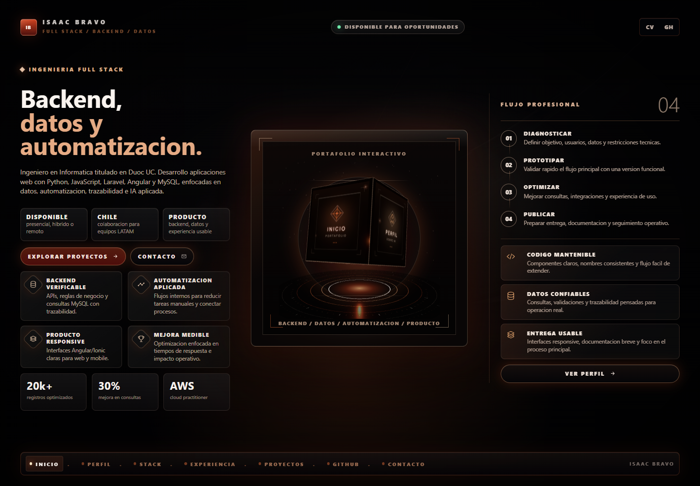
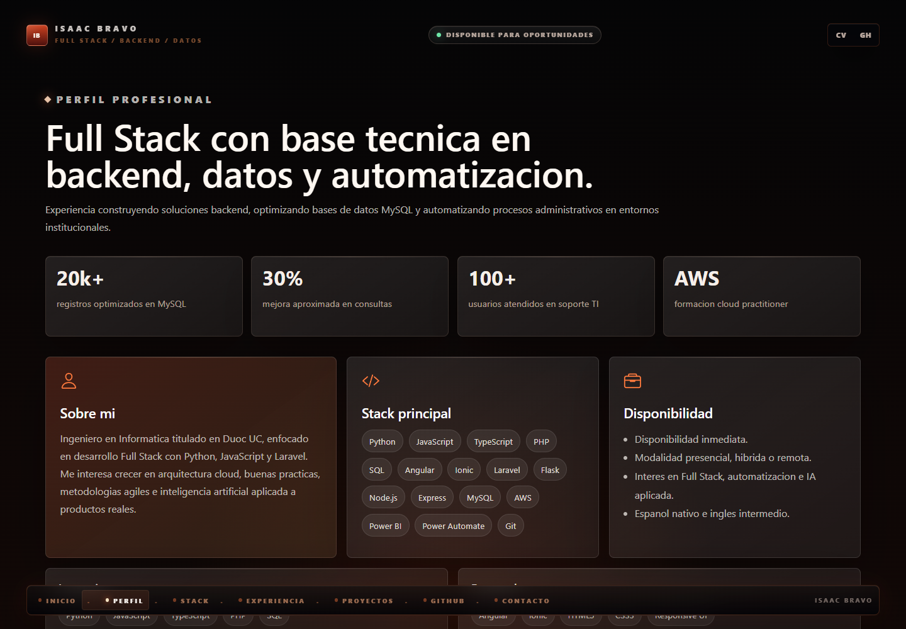
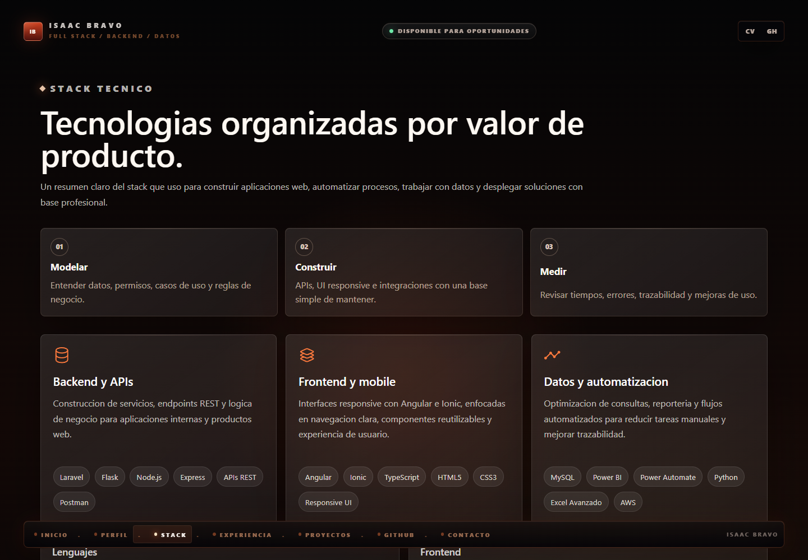
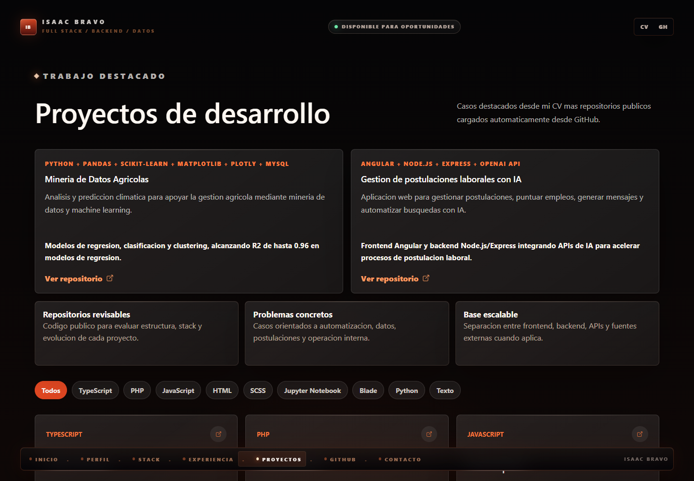
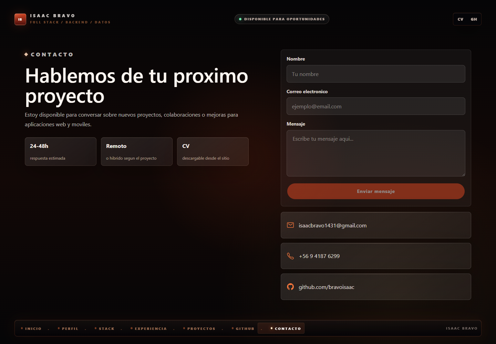

# Portafolio Profesional | Isaac Bravo

Aplicacion web de portafolio personal desarrollada con **Angular**, **Ionic** y **Capacitor**. Presenta el perfil profesional de Isaac Daniel Bravo Melo, su experiencia, stack tecnico, proyectos destacados, repositorios publicos de GitHub y canales de contacto.



## Indice

- [Descripcion](#descripcion)
- [Capturas](#capturas)
- [Funcionalidades](#funcionalidades)
- [Tecnologias](#tecnologias)
- [Rutas principales](#rutas-principales)
- [Instalacion](#instalacion)
- [Scripts disponibles](#scripts-disponibles)
- [Estructura del proyecto](#estructura-del-proyecto)
- [Build y despliegue](#build-y-despliegue)
- [Autor](#autor)

## Descripcion

Este proyecto funciona como carta de presentacion profesional para mostrar experiencia en desarrollo Full Stack, backend, datos, automatizacion y aplicaciones web responsivas.

La aplicacion incluye una experiencia visual con hero principal, navegacion por secciones, artefacto 3D interactivo con Three.js, tarjetas de stack tecnico, casos destacados, carga de repositorios desde GitHub y formulario de contacto integrado con EmailJS.

## Capturas

| Inicio | Perfil |
| --- | --- |
|  |  |

| Stack tecnico | Proyectos |
| --- | --- |
|  |  |

| Contacto |
| --- |
|  |

## Funcionalidades

- Navegacion interna por secciones del portafolio.
- Hero visual con imagen principal y acciones rapidas.
- Cubo/diamante 3D interactivo para explorar secciones.
- Perfil profesional con resumen, disponibilidad, formacion y certificaciones.
- Stack tecnico agrupado por frontend, backend, datos, cloud y automatizacion.
- Experiencia profesional presentada en formato timeline.
- Proyectos destacados desde el CV.
- Carga automatica de repositorios publicos desde la API de GitHub.
- Filtros de proyectos por lenguaje.
- Formulario de contacto conectado a EmailJS.
- CV descargable desde `src/assets/CV_Isaac_Bravo_FullStack.pdf`.
- Diseno responsive para escritorio y dispositivos moviles.

## Tecnologias

| Area | Tecnologias |
| --- | --- |
| Framework principal | Angular 20 |
| UI / Mobile | Ionic 8, Capacitor 8 |
| Lenguaje | TypeScript |
| Estilos | SCSS |
| Interaccion 3D | Three.js |
| Iconos | Ionicons |
| Datos externos | GitHub API |
| Contacto | EmailJS API |
| Testing | Karma, Jasmine |
| Calidad | ESLint, Angular ESLint |

## Rutas principales

| Ruta | Descripcion |
| --- | --- |
| `/home` | Pantalla inicial del portafolio. |
| `/perfil` | Perfil profesional, stack base y disponibilidad. |
| `/stack` | Tecnologias organizadas por area de trabajo. |
| `/experiencia` | Experiencia laboral, formacion y certificaciones. |
| `/proyectos` | Casos destacados y repositorios cargados desde GitHub. |
| `/github` | Enlace directo al perfil de GitHub. |
| `/contacto` | Formulario y datos de contacto. |

## Instalacion

Clona el repositorio, entra a la carpeta del proyecto e instala las dependencias:

```bash
npm install
```

Ejecuta la aplicacion en modo desarrollo:

```bash
npm start
```

La aplicacion queda disponible en:

```text
http://localhost:4200/
```

## Scripts disponibles

| Comando | Descripcion |
| --- | --- |
| `npm start` | Inicia el servidor de desarrollo de Angular. |
| `npm run build` | Genera la version de produccion en `www/`. |
| `npm run watch` | Compila en modo observacion para desarrollo. |
| `npm test` | Ejecuta pruebas con Karma y Jasmine. |
| `npm run lint` | Ejecuta ESLint sobre archivos TypeScript y HTML. |

## Estructura del proyecto

```text
portafolio-personal/
  docs/
    images/
      home.png
      perfil.png
      stack.png
      proyectos.png
      contacto.png
  src/
    app/
      home/
        home.page.html
        home.page.scss
        home.page.ts
        obsidian-cube.renderer.ts
      app.routes.ts
    assets/
      CV_Isaac_Bravo_FullStack.pdf
      hero-portfolio.png
    theme/
      variables.scss
  angular.json
  capacitor.config.ts
  ionic.config.json
  package.json
```

## Build y despliegue

Para generar una version lista para produccion:

```bash
npm run build
```

Angular genera los archivos finales en:

```text
www/
```

Esa carpeta puede publicarse en servicios de hosting estatico compatibles con aplicaciones SPA. Si se usa Capacitor, `www/` tambien funciona como directorio web para empaquetar la app.

## Autor

**Isaac Daniel Bravo Melo**

- GitHub: [bravoisaac](https://github.com/bravoisaac)
- Correo: [isaacbravo1431@gmail.com](mailto:isaacbravo1431@gmail.com)
- CV: `src/assets/CV_Isaac_Bravo_FullStack.pdf`
